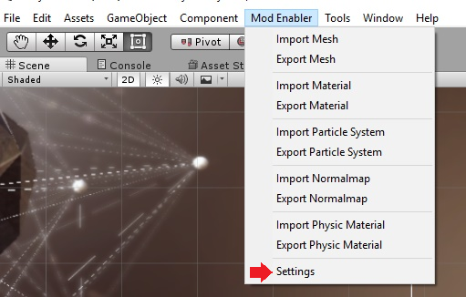
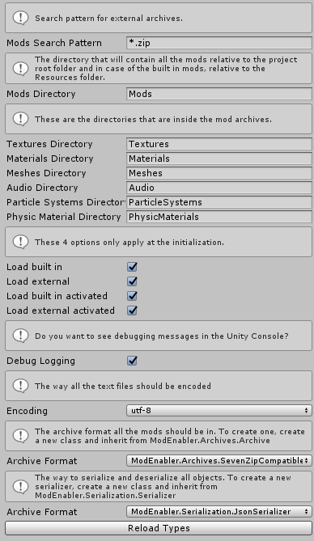
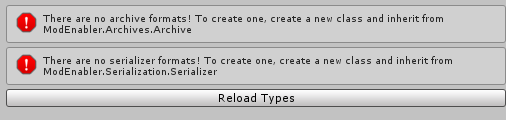

# Settings

ModEnabler has a bunch of settings. The settings file gets saved in `Assets/ModEnabler/Resources/Settings.asset`. An easy way to change the settings is by going to `Mod Enabler>Settings` in the top bar.

The "Mods Search Pattern" format is that from [Microsoft]

When you get the following errors, it might help to hit the "Reload Types" button.

  [Microsoft]: https://msdn.microsoft.com/en-us/library/ms143316(v=vs.110).aspx#Anchor_2